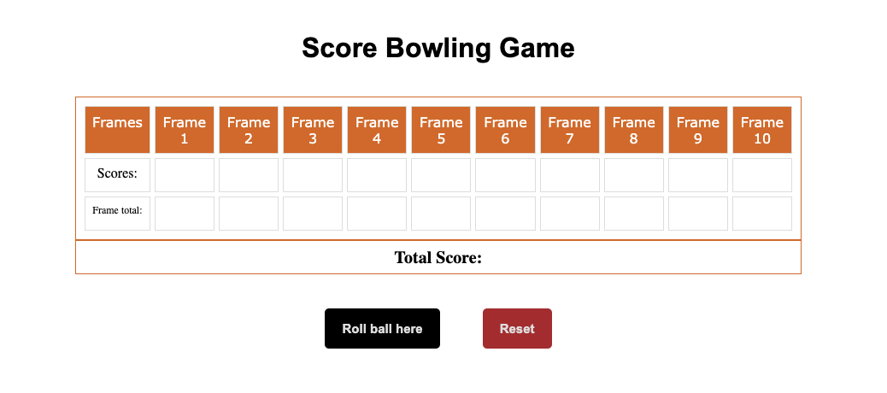

# Scoring a Bowling Game
The game consists of 10 frames. A frame is composed of one or two ball throws with 10 pins standing at frame initialization.
## App

### Built with  
- HTML
- CSS
- JavaScript
### Prerequisites
knowlegde about:
- HTML
- CSS
- JavaScript
- Google chrome
## Clone project
Get a local copy of this project by following the steps below:
- clone this repository with `https://github.com/Nathanael-Lontsi/scorebowling`
- Move to the project directory by typing the following: cd JavaScript and cd grid-rotator in your terminal.
## Steps
- $ git clone `https://github.com/Nathanael-Lontsi/scorebowling`
- $ `cd scorebowling`
- $ `git checkout feature/container`
## Start up
- Run by opening index.html using the browser
: bust_in_silhouette: **Nathanael-Lontsi**
- Github: [@Nathanael-Lontsi](https://github.com/Nathanael-Lontsi/scorebowling)
## :handshake: Contributions
Contribution, issues and feature requests are all welcome!
Feel free to check the [issues page](https://github.com/Nathanael-Lontsi/scorebowling/issues)
## :memo :License
This project is [rebaseacademy](./LICENSE) licensed.